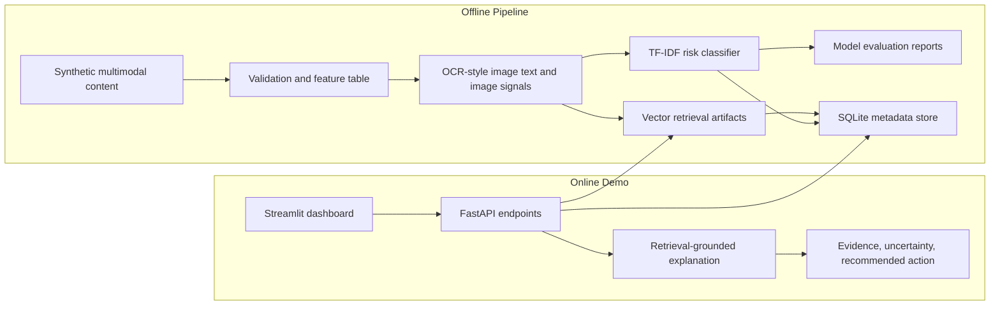
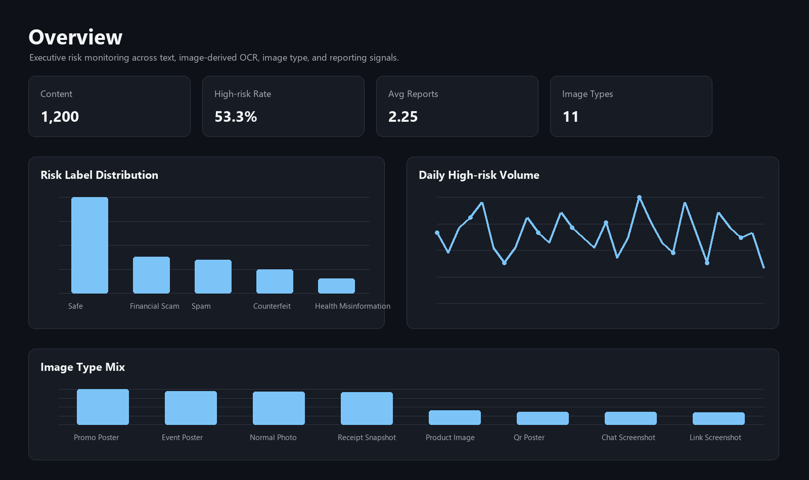
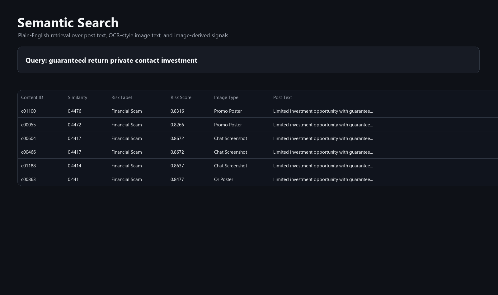
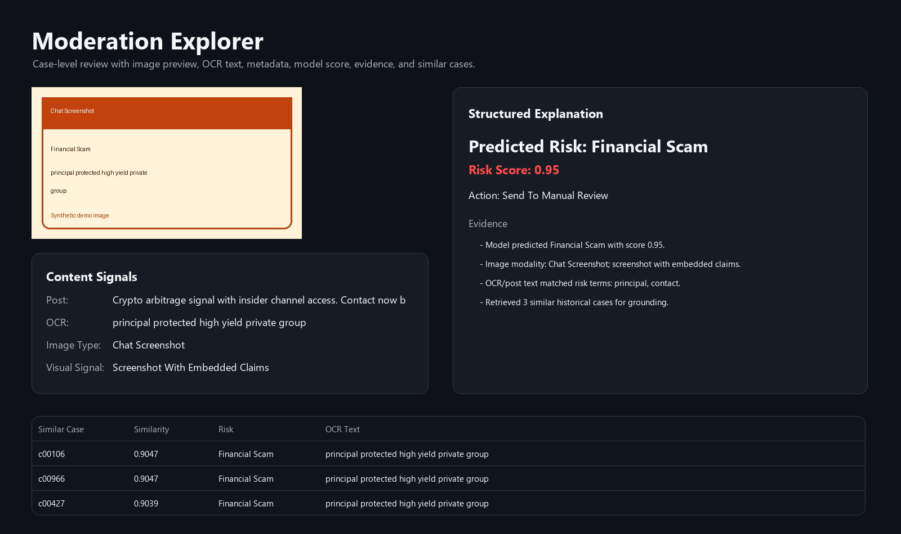
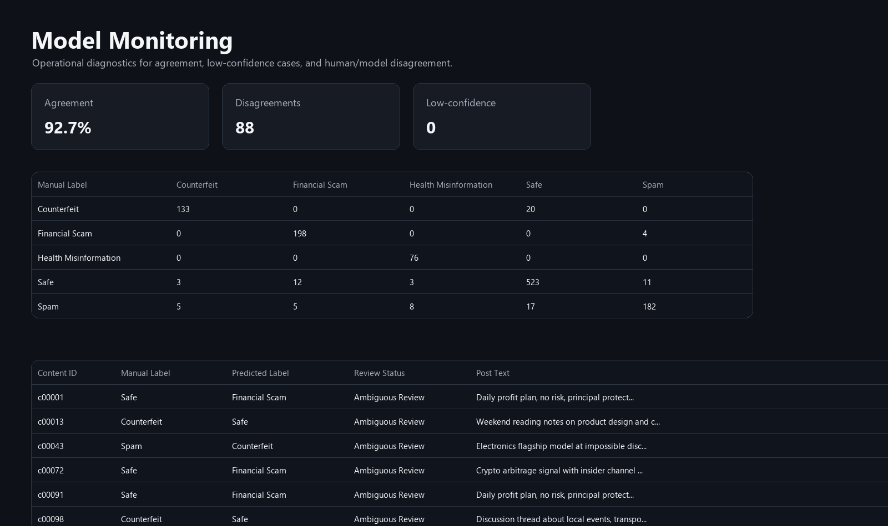

# Multimodal Content Intelligence & RAG Platform

A lightweight portfolio project for trust & safety analytics, semantic search, and retrieval-grounded content review. The project is intentionally resource-aware: heavy feature extraction and model training run offline, while the online demo serves precomputed artifacts through a small API and Streamlit dashboard.

The demo website can be accessed via [http://124.222.219.226:8502](http://124.222.219.226:8502).

## Why This Project

Many platform teams need to understand mixed qualitative and quantitative content signals: post text, OCR text, image-derived metadata, user/report metrics, historical labels, model scores, and policy evidence. This project turns that workflow into a compact end-to-end system that can run on a small CPU server while still demonstrating practical LLM/RAG, vector search, model evaluation, and dashboarding.

The current demo uses public-style synthetic data. It does not use private platform data.

## Architecture



```text
Offline pipeline
  synthetic content data
    -> validation and feature table
    -> OCR-text feature simulation
    -> TF-IDF risk classifier
    -> vector retrieval index
    -> SQLite metadata store
    -> evaluation reports

Online serving
  Streamlit dashboard
    -> FastAPI routes
      -> SQLite metadata
      -> vector search
      -> retrieval-grounded structured explanation
```

## Dashboard Previews

The preview images below are generated from the current demo artifacts with `scripts/render_readme_assets.py`.

### Overview



### Semantic Search



### Moderation Explorer



### Model Monitoring



## MVP Features

- Synthetic multimodal content dataset with post text, generated demo images, OCR-style image text, image type signals, engagement metrics, reports, and manual labels.
- Offline risk model using TF-IDF plus Logistic Regression.
- Vector retrieval over combined post and OCR text, with FAISS-ready design and a NumPy/scikit-learn fallback for local demos.
- Retrieval-grounded moderation explanations with Pydantic-validated structured output.
- SQLite metadata store for content, predictions, and review artifacts.
- FastAPI backend exposing health, search, content lookup, moderation, and insight endpoints.
- Streamlit dashboard for overview, semantic search, moderation explorer, and model monitoring.
- Reports for data quality, model evaluation, retrieval evaluation, and RAG behavior.

## Quick Start

Conda is recommended for local development:

```bash
conda create -n m-rag python=3.12 -y
conda activate m-rag
pip install -r requirements.txt
```

Build the demo artifacts and launch the dashboard:

```bash
python scripts/build_demo.py --rows 1200
streamlit run app/streamlit_app.py --server.port 8502
```

Optional API:

```bash
uvicorn content_intel.api.main:app --app-dir src --host 0.0.0.0 --port 8000
```

Docker:

```bash
docker compose up --build
```

The Docker containers run `scripts/ensure_demo.py` on startup, so a fresh clone can build the demo artifacts automatically if `data/processed/content.db` and the retrieval artifacts are missing.

Regenerate README preview images:

```bash
python scripts/render_readme_assets.py
```

## API Examples

```bash
curl -X POST http://localhost:8000/search ^
  -H "Content-Type: application/json" ^
  -d "{\"query\":\"high return investment with contact info\",\"top_k\":5}"
```

```bash
curl -X POST http://localhost:8000/moderate ^
  -H "Content-Type: application/json" ^
  -d "{\"content_id\":\"c00001\"}"
```

## Portfolio Positioning

Resume bullet candidates:

- Built a lightweight content intelligence and RAG platform integrating offline OCR-text features, vector retrieval, structured risk reasoning, FastAPI serving, and Streamlit dashboards for trust & safety analytics.
- Designed an offline-heavy, online-lightweight architecture that precomputes model predictions and retrieval indexes while serving low-latency search and moderation explanations from SQLite and vector artifacts.
- Implemented evaluation reports for data quality, classification metrics, retrieval Recall@K, disagreement analysis, and retrieval-grounded explanation reliability.

## Suggested Demo Flow

For a short portfolio walkthrough:

1. Open the Overview tab to explain the content corpus, risk mix, high-risk trend, and image type mix.
2. Open Semantic Search and search for `guaranteed return private contact investment` to show vector-style retrieval.
3. Open Moderation Explorer to show the image preview, OCR-style text, model score, evidence, policy snippets, and similar cases.
4. Open Model Monitoring to explain why agreement is high but not perfect and how disagreement samples support model improvement.
5. Open Insight to show how local analytics plus retrieval can produce a business-facing summary without requiring a paid external LLM in the MVP.

## Resource-Aware Design

- No local LLM is required for the demo path.
- OCR/CV work is represented as offline pipeline artifacts instead of resident online services.
- FAISS can be enabled by installing `faiss-cpu`; the checked-in implementation also works with a portable sparse-vector fallback.
- SQLite is used for a compact deployable metadata store.

## Multimodal Scope

This MVP keeps the multimodal layer lightweight enough for a small CPU machine. The offline pipeline generates small demo images and stores image-derived fields such as `ocr_text`, `image_type`, `image_text_density`, and `visual_risk_signal`. The risk model, retrieval index, moderation explanation, and dashboard all consume those image-derived signals together with post text and engagement metadata.

The current version does not keep PaddleOCR, CLIP, or PyTorch models resident in memory. A production extension could replace the synthetic OCR/image signals with real offline OCR, CLIP embeddings, and FAISS image retrieval while preserving the same online API and dashboard workflow.

## Limitations and Next Steps

This is a portfolio-oriented MVP, not a production moderation system. The demo intentionally uses synthetic data and lightweight image-derived signals so it can run on a small CPU machine.

Current limitations:

- OCR text is generated as an offline demo artifact rather than extracted by a resident OCR model.
- Image understanding uses lightweight `image_type`, `image_text_density`, and `visual_risk_signal` fields rather than CLIP embeddings.
- The default retrieval backend is sparse TF-IDF cosine similarity; the interface is designed so FAISS and dense embeddings can replace it later.
- The RAG explanation path is deterministic and schema-validated; a production version could call OpenAI, Qwen, DeepSeek, or another LLM provider for the final summary.
- The labels and metrics are synthetic and should not be interpreted as real-world moderation performance.

High-value extensions:

- Add offline PaddleOCR or EasyOCR extraction for real image text.
- Add CLIP or another vision embedding model for image-to-image and text-to-image retrieval.
- Add human-in-the-loop label editing in the dashboard and persist reviewer feedback to SQLite.
- Add authentication and audit logging for a more production-like review workflow.
- Add external LLM provider support behind the current structured explanation schema.
